# Animal United Front
山奥に住んでいる凸凹トリオである「ネコ」、「ペンギン」、「ニワトリ」。  
ある日ベトベトの糸が山中のいたるところに広がっており、危険な大クモの仕業であると気づきました。  
３トリオは大クモを退治することを決意、「やられる前にやる」…弱肉強食の戦いが幕を明けるのでした！  
<br>
それぞれの特徴を持った３キャラクターをうまく切り替え、EnemyやBossを退治します<br>
[サンプルプレイはこちら](https://dynarise2001.xyz/kunren/animal_united_front_green_team/)
<br><br>

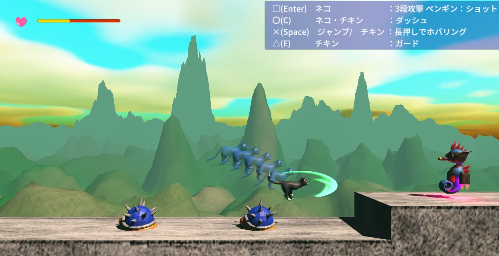

## 概要
この「Animal United Front」は複数人による共同開発として作成したゲームです。  
ジャンルは横スクロールの3Dアクションゲームで、敵を撃破しながらステージを進んでいき
最終的にはボスである巨大なクモを倒すゲームとなっています。  
プログラミングを学んで2ヵ月あまりのメンバーですが、それぞれの役割を懸命にこなして作成しました。  
このREADMEでは本ゲームにおいて工夫したポイントを紹介していきます。  

## 開発環境・仕様ツール
※すべて無料の範疇で作成<br>
* Unity Editor 6000.3.5f2  
* VisualStudio2026
* Git/GitHub
* SourceTree
<br><br>
    
<使用アセット>
* Fantasy Skybox FREE … メインのSkyboxとして使用
* FreeQuickEffectsVol1 … 斬撃や弾などに使用
* Animals FREE - Animated Low Poly 3D Models … Playerキャラに使用
* Spider orange. … Bossキャラに使用
* RPG Monster Duo PBR Polyart … Enemyキャラに使用
* Drone Companions Starter Pack …  Enemyキャラに使用

<使用サウンド>
* BGM （DOVA-SYNDROME)
* SE (効果音ラボ)

## 開発期間
2026.03.12　~　2026.03.20  
製作時間：およそ30時間  
(モデリングなしのプロトVer. 18時間、　モデル後の調整Ver. 12時間)

## ゲーム内容の特徴
### ー ゲームパッドに対応（InputSystem）
本ゲームはキーボードにも、ゲームパッドにも対応できるように作っています。  
Unityの「InputSystem」を採用、操作キャラのオブジェクトには「PlayerInputコンポーネント」を付与、スクリプトでどのボタンを押したらどうなるのか書き分けています。<br><br>
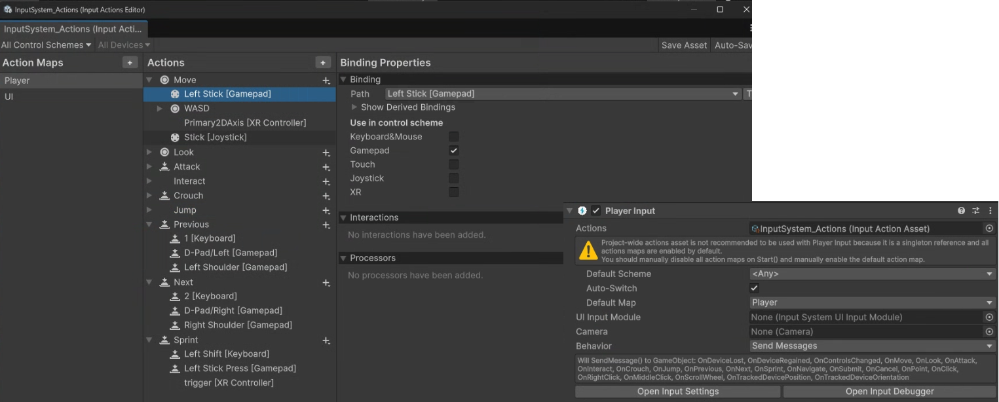

#### （抜粋）InputSystemのスクリプトの例
```C#

    //移動ボタン
    void OnMove(InputValue value)
    {
        // ダッシュ中でなければ通常の入力を受け付け
        if (!isDashDirectionOverridden && canMoveInput)
        {
            Vector2 input = value.Get<Vector2>();
            inputDirection = input.x;
            
            if (inputDirection > 0)//右キーを押していたら
            {
                lastInputDirection = 1; //プラスの座標
            }
            else if (inputDirection < 0)//左キーを押していたら
            {
                lastInputDirection = -1; //マイナスの座標
            }
        }
        // ダッシュ中だが、空中にいる場合も方向を手に入れることが可能
        else if (isDashDirectionOverridden && !controller.isGrounded)
        {
            Vector2 input = value.Get<Vector2>();
            inputDirection = input.x;

            if (inputDirection > 0)
            {
                lastInputDirection = 1;
            }
            else if (inputDirection < 0)
            {
                lastInputDirection = -1;
            }
        }
        else //ダッシュ中でなく、ボタン入力もなければ移動量は0
        {
            inputDirection = 0;
        }
    }

    //L1ボタン（ペンギンへの切り替え）
    void OnPrevious(InputValue value)
    {
        if (playerChanger.isPlayer3)  //もしニワトリ キャラ使用中
        {
            //ペンギンに切り替え
            playerChanger.Player2Change(); 
        }
        else if (!playerChanger.isPlayer3) //ニワトリ キャラでない時
        {
            if (!playerChanger.isPlayer2) //まだペンギンでないなら
            {
                //ペンギンに切り替え
                playerChanger.Player2Change();
            }
            else //すでにペンギンなら
            {
                //デフォルト（ネコ）に戻す
                playerChanger.DefaultPlayerChange();
            }
        }
    }

    //R1ボタン（ニワトリへの切り替え）
    void OnNext(InputValue value)
    {
        if (playerChanger.isPlayer2)　//もしペンギン キャラ使用中
        {
            //ニワトリに切り替え
            playerChanger.Player3Change();
        }
        else if (!playerChanger.isPlayer2)//ペンギン キャラでない時
        {
            if (!playerChanger.isPlayer3)//まだニワトリでないなら
            {
                //ニワトリに切り替え
                playerChanger.Player3Change();
            }
            else//すでにニワトリなら
            {
                //デフォルト（ネコ）に戻す
                playerChanger.DefaultPlayerChange();
            }
        }
    }
```

  
<ゲーム中の操作案内>  
ゲーム中にも操作方法を示すUIを表示し、ユーザーの混乱をおさえるように努めています。  
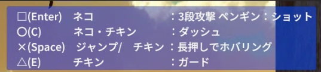

### ー Playerキャラを切り替えながらプレイ
特定のボタンを押すと、キャラクターチェンジ（ペンギン or ニワトリ）ができます。  
ボタンワンタッチで任意に切替/解除ができます。  
時間制限を示す残メーターがあり、メーターを使い切ると強制解除でデフォルトキャラ（ネコ）なります。  
デフォルトキャラの間は残メーターが自動回復していきます。  <br><br>

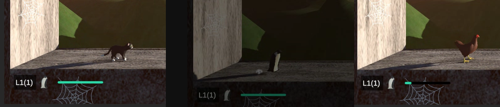

各キャラクターはあらかじめて別キャラとしてプレハブ化、専用スクリプト「PlayerChanger.cs」にて、切替ボタンを検知すると、切替前のキャラクターの座標に、生成したキャラが違和感なく置き換わるようにしています。

### ー Enemyのバリエーション
Enemyは4種類のプレハブを用意しました。それぞれにアクションゲームらしい特徴があり、4通りのスクリプトを用意しています。
* 往復移動するやられ役
* 一定距離に近づくと、弾を投擲してくる
* Playerを発見すると、Playerめがけて突進してくる
* 一定間隔でシールド防御とシュートを繰り返す（防御中は無敵）  <br><br>
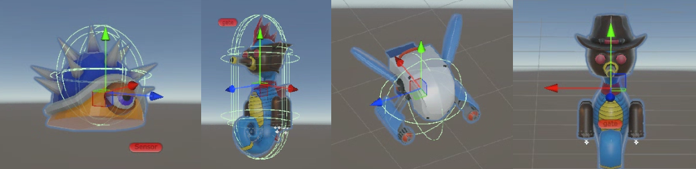


### ー Bossとの戦闘
ステージを乗り越えた後にはBossとのバトルを用意しています。  
Bossバトルは駆け引きを楽しめるように、回避に集中するターンと、攻撃チャンスとなるターンを明確に設計しました。  
BossはPlayerとの距離に応じて、攻撃パターンを変化させます。  
Playerの接近攻撃ならBossに連続してダメージを与えることができますが、その分攻撃をもらいやすいなど、リスクとリターンが両立するように設計しています。

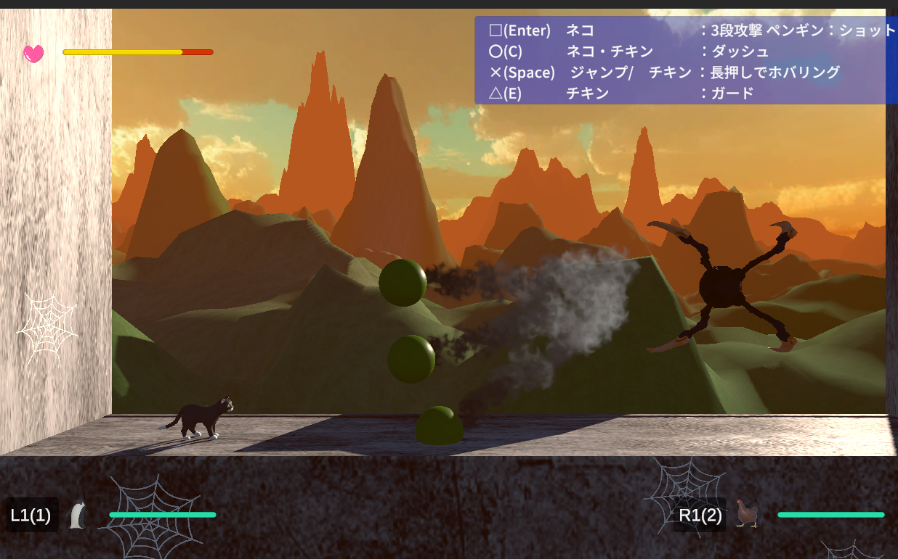

### ー デモシーンの導入
ユーザーが自然とゲームプレイに入っていけるよう、ストーリーデモシーンを用意しています。  
Boss撃破後もキャラクターたちがコントを繰り広げるデモシーンがあり、
「Bossを撃破して即Title」のような淡泊なつくりを避けています。  
デモシーンはシンプルな内容で短いですが、撃破後の余韻をつくることで、ゲームクリアの実感や達成感が生まれるよう努めました。  

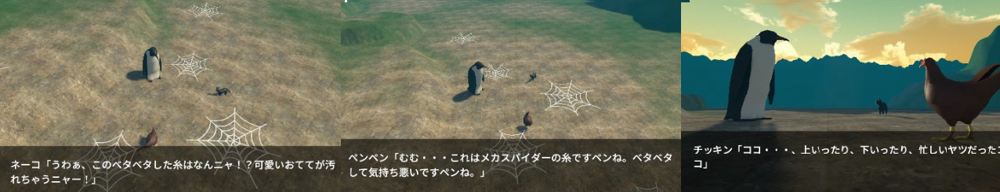

## 開発分担
本ゲームはGitHubで開発状況を管理しています。  
各担当ごとにブランチを分け、それぞれを並行して開発しました。  
主な区分けとして
* Player動作
* Enemy2種 x2
* Boss動作  
に分け、マージと再分担を繰り返して完成させました。<br><br>
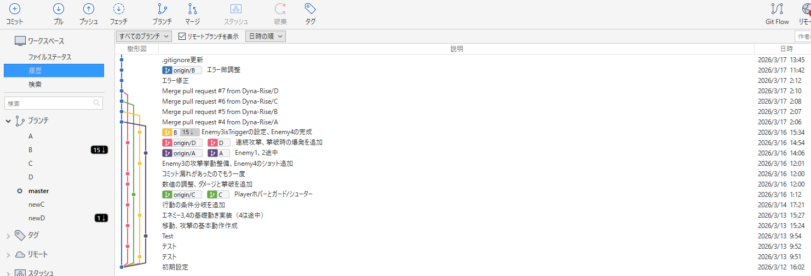
<br><br>

### ー Player開発の特徴
Playerの機能を細分化し、共通動作は各キャラに使いまわしています。  

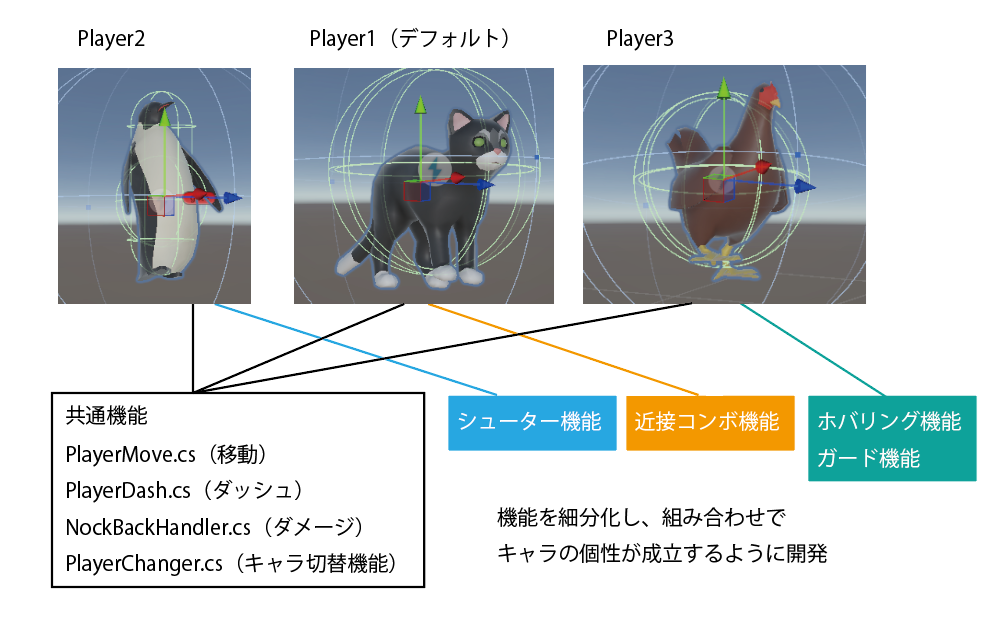
<br><br><br><br>

* ネコ （近接コンボ）  
アクションボタンで斬撃となる当たり判定を発生させます。  
ボタンプッシュが特定時間内に重なることでコンボとして繋がるようにしています。  
— 時間経過によってコンボの計算が1段目に戻るようにする  
— 3段目のコンボの後にはインターバルを設けるなど、攻撃のリズムがあり駆け引きができるようにしました。<br><br>
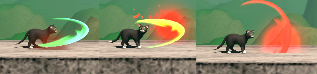
<br><br>
* ペンギン（ショット）   
アクションボタンでプレハブ化したショットを生成、Rigidbodyの力で射出します。  
Player本体との接触判定で弾が消失しないよう、レイヤー同士の衝突判定を絞るなど工夫しています。<br><br>
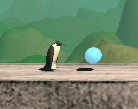
<br><br>
* ニワトリ（ホバリング / ガード）  
それぞれ「ボタンを押しっぱなしにする」「ボタンをはなした」ということをシステムに認識させるにはどうすればよいか、InputSystemの設定や数値調整の試行錯誤を行いました。  
特にホバリングは重力値との兼ね合いで数値調整に苦労しました。<br><br>
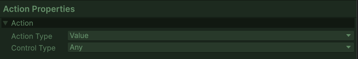<br>
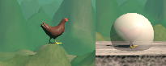

<br><br>

### ー Enemy開発の特徴
4種類のEnemyをプレハブ化、量産配置できるようにしています。  
それぞれにアクションゲームらしい特徴をもたせ、独自のスクリプトで動かしています。
<br><br>

* Enemy1 (往復運動)  
センサーとなるオブジェクトにレイヤーを感知させ、崖で引き返すようにしています。  
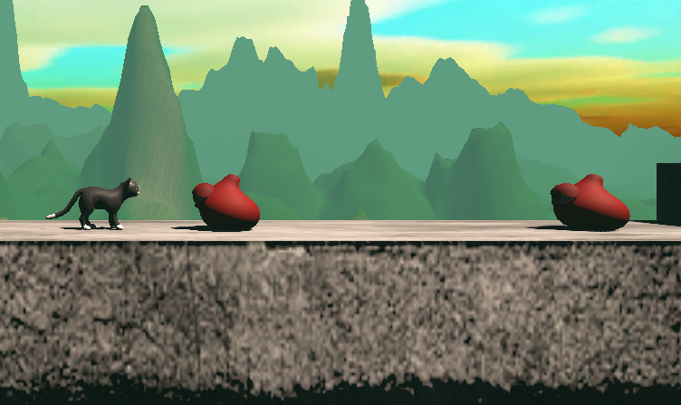<br><br>

```C#
    //抜粋    
    
    void FixedUpdate()
    {
        //ダメージが入っているなら動きが鈍い
        if(damageTimer > 0) rbody.linearVelocity = new Vector3(direction, 0, 0) * damageSpeed;
        else rbody.linearVelocity = new Vector3(direction, 0, 0) * speed;
    }
    
    //センサーがGroundを抜けた場合
    void OnTriggerExit(Collider other)    
    {
        if (other.gameObject.layer == 6)
        {
            direction *= -1; //逆転させる
        }
    }
```
<br><br>
* Enemy2（一定間隔で弾を投擲）  
特定の方角にRigidbodyで投擲することに加え、一定間隔で発射されるよう時間計測しています。  
またずっとショットが残留しないよう、時間経過で弾が自然消滅するようにするなど細かく工夫しています。  
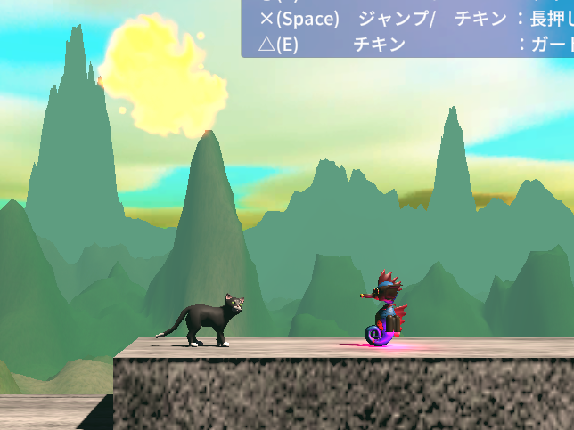<br><br>

* Enemy3（飛行 / 索敵範囲内ならPlayerに突進）  
Playerとの距離に応じて2つの動きを切り替えて行動します。  
— 索敵範囲外なら左に向かって真っすぐ飛行  
— 索敵範囲内なら、Playerの方角を逆三角関数(ATan)で求める  
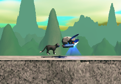<br><br>

* Enemy4（ガードと攻撃を交互に繰り返す）  
一定間隔で「盾の防御」と「シュート攻撃」を繰り返します。  
特に盾をかまえている間は正面からはダメージが通らないようなど工夫しています。  
盾の出現座標などオブジェクト細かい調整も大変でした。  
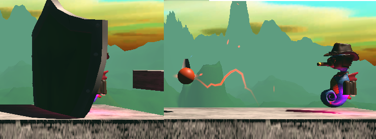<br><br>

### ー Boss開発の特徴
Bossは専用ステージにて「急襲」と「逃亡」を繰り返します。  

* 逃亡 / 急襲 フェイズ  
クモらしく糸に垂れ下がってくるイメージで画面外（上部）への「逃亡」と、画面内に突然降ってくる「急襲」を繰り返します。  
フラグ管理や線形補間関数(Lerp)をうまく活用しています。  
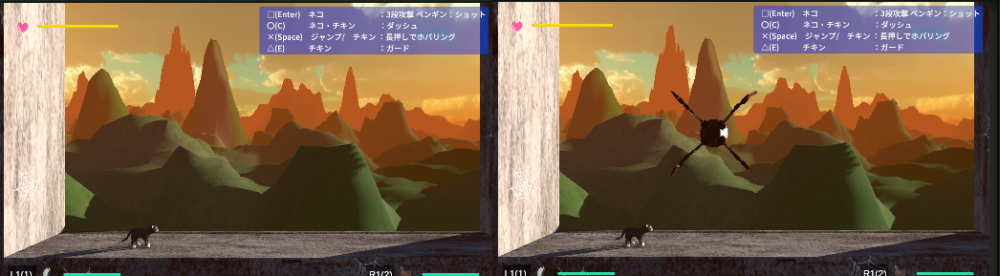<br><br>

* 攻撃 フェイズ  
Playerとの距離に応じて、足の斬撃を行ったり、ショットを打ってきたりします。  
特に斬撃は発生がはやく見てからの回避が困難なので、Playerの接近コンボをいつ叩き込むかという駆け引きが発生します。  
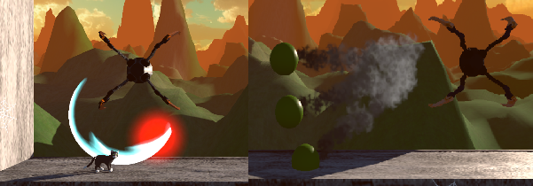<br><br>
ボスバトルはプレイを楽しくなるよう、行動にメリハリをつけて駆け引きを成立させています。  
何度もテストして簡単すぎず、難しすぎずのバランス調整を頑張りました。  


## Terrainで地形を構築
デモシーンの地形にはTerrainシステムを使用しています。  
無料アセットのテクスチャーのいくつかをTerrainにも再利用して、ゲームが重くならないよう工夫をしています。  
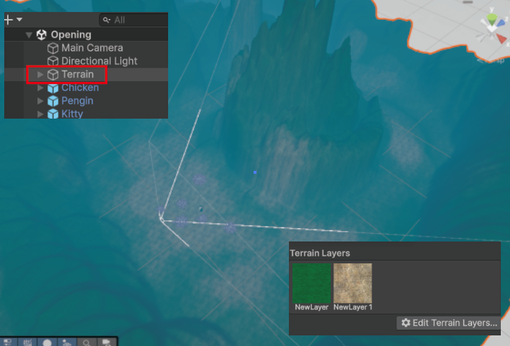<br><br>
また、作成したTerrainにクモの糸テクスチャーを使ったQuadオブジェクトを配置して、Bossであるクモに悩まされているという演出をしています。  
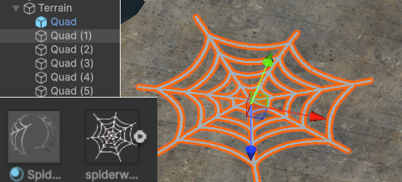<br><br>


## CinemaChineの利用
オープニングやエンディングのデモシーンではCinemaChineライブラリを活用してカメラワークを作っています。  
複数台のViartualCameraをTimeLine機能で切り替え、セリフと噛み合うように調整しています。  
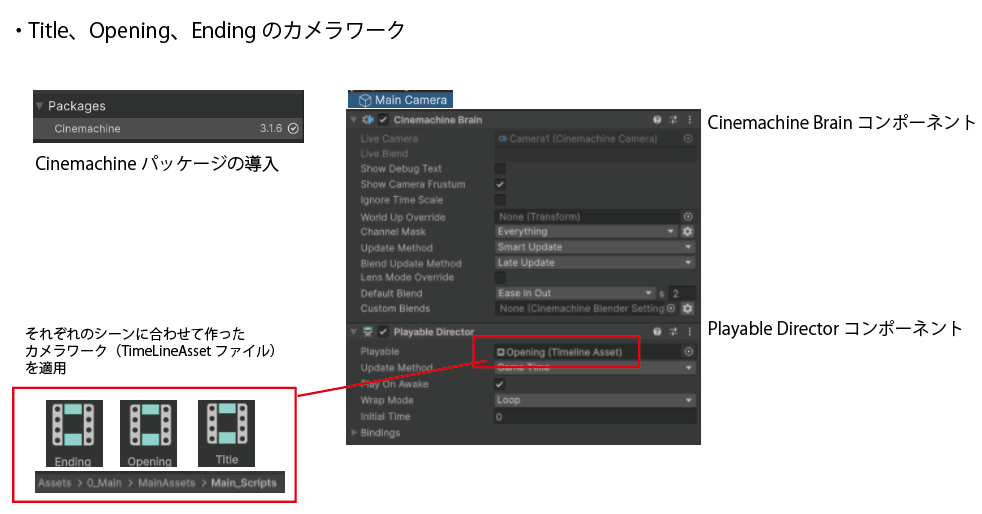<br><br>
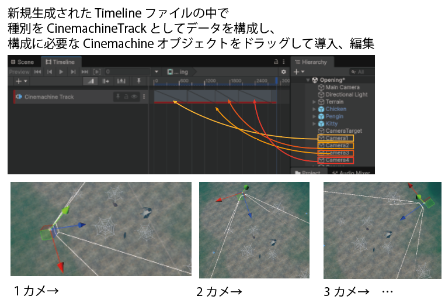<br><br>

## ScriptableObjectでデモシーンの会話セリフデータを保管
会話は専用のデータコンテナ(Talk.cs)とそれを取り扱うScriptableObject「TalkData.cs」を用意しました。  
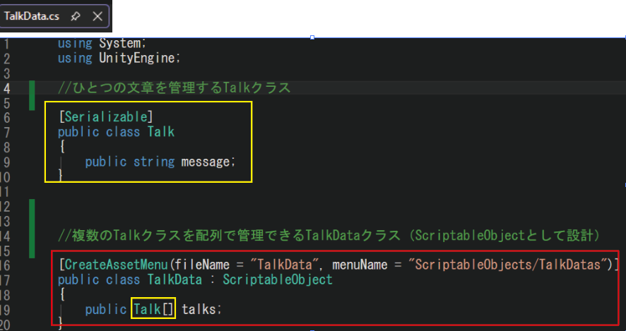<br><br>
各デモシーンのCanvasに「TalkController.cs」を設け、スクリプトに変数として指定したTalkDataから順番にセリフを拾っては、UIに反映させています。  
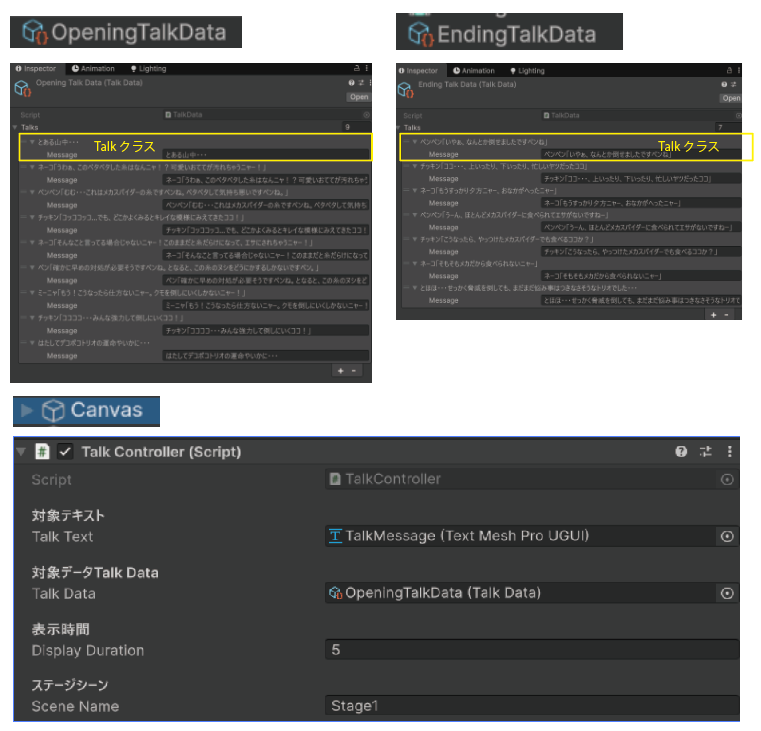<br><br>

```C#
//TalkController.csの抜粋

[Header("対象テキスト")]
public TextMeshProUGUI talkText;

[Header("対象データTalk Data")]
public TalkData talkData; 

[Header("表示時間")]
public float displayDuration = 4.0f;


/// セリフを設定秒ごとに順番に表示するコルーチン
private IEnumerator DisplayTalksCoroutine()
{
    //全部のセリフをいうまで繰り返し
    while (currentTalkIndex < talkData.talks.Length)
    {
        // 現在のセリフを取得
        Talk currentTalk = talkData.talks[currentTalkIndex];

        // UIにセリフを表示
        if (talkText != null)
        {
            talkText.text = currentTalk.message;
        }

        // 指定された時間待機
        yield return new WaitForSeconds(displayDuration);

        // 次のセリフへ進む
        currentTalkIndex++;
    }

    // すべてのセリフが表示された後の処理
    yield return new WaitForSeconds(3.0f);
    //変数に指定したシーンに飛ぶ
    SceneManager.LoadScene(sceneName);
}
```


## GitHubでの作業
共同作業にはGitHubのブランチを活用しています。  
マージの際に衝突がおこらないよう、分担作業は決められたフォルダ内など、ルールをチームで徹底しました。  
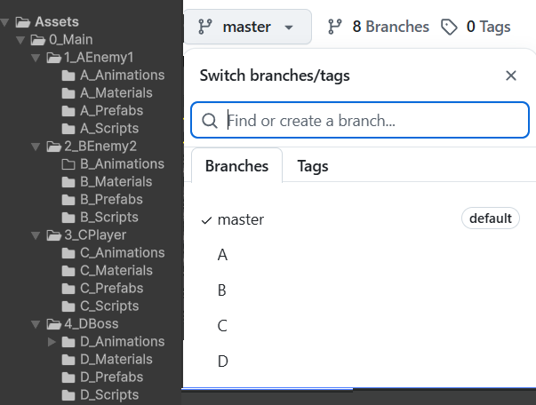<br><br>

また、プロトタイプとして合わせる納期が定まっており、最初は3営業日（18時間程度）である程度完成させないといけないたため、タイトなスケジュールにおいて、どこを重要視すべきか考えさせられる作業でした。  
個人製作よりも責任が重いので、クオリティを安易にできない一方で、納期を守るためにどこまで妥協すべきか悩まされました。  
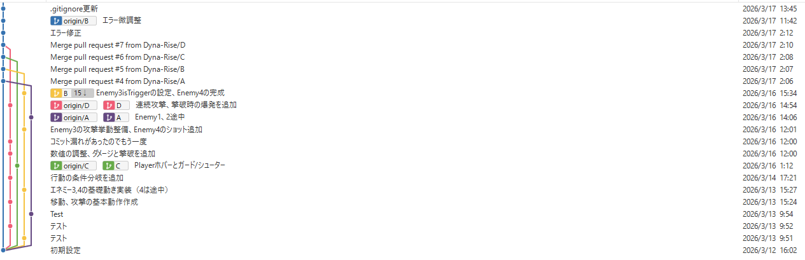<br><br>

結合後も多少のトラブルもありましたが、各々がテストを行いながら(Issues参照)、  
チームで問題解決して現在ver.までブラッシュアップ、一定のクオリティとしてまとまり安心しました。  

## 課題
今後、このゲームを発展させるとしたら
* アイテムの出現（回復や強化など）
* Playerの攻撃力の設定
* 時間制限
* 難易度選択（敵の配置やパラメータ調整）
* ギミックの追加（動く足場、強制スクロールステージなど）  <br><br>
まだまだ改良の余地があるので、個人でもアレンジを続けることができれば幸いです。

